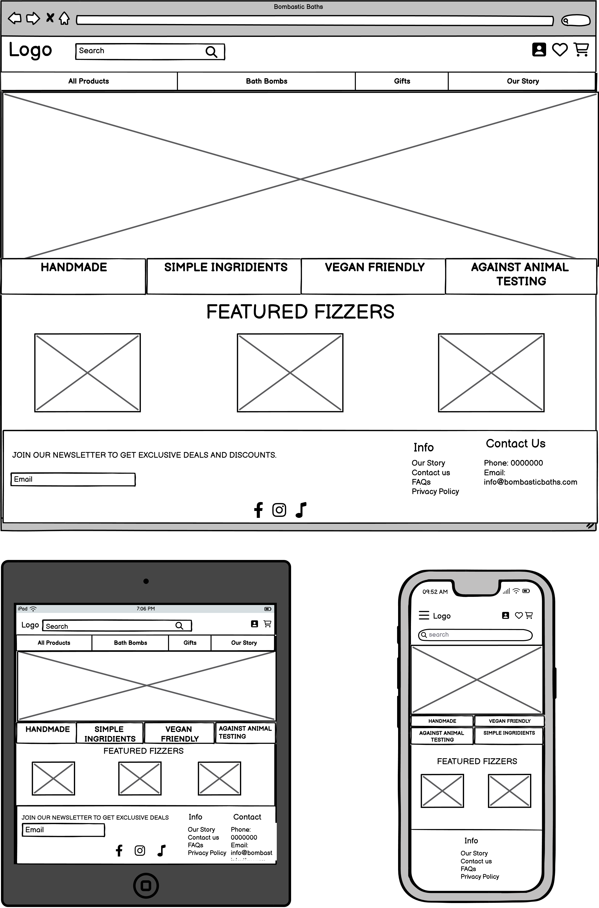
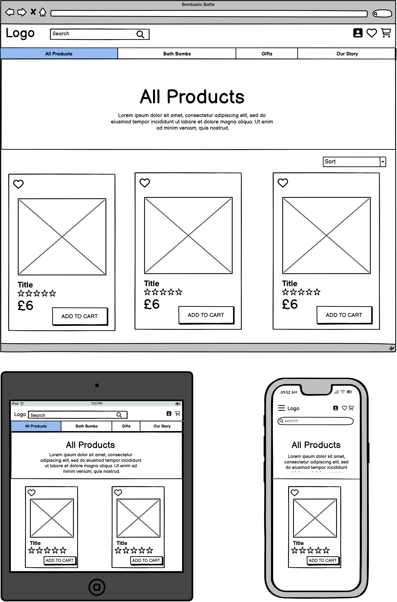
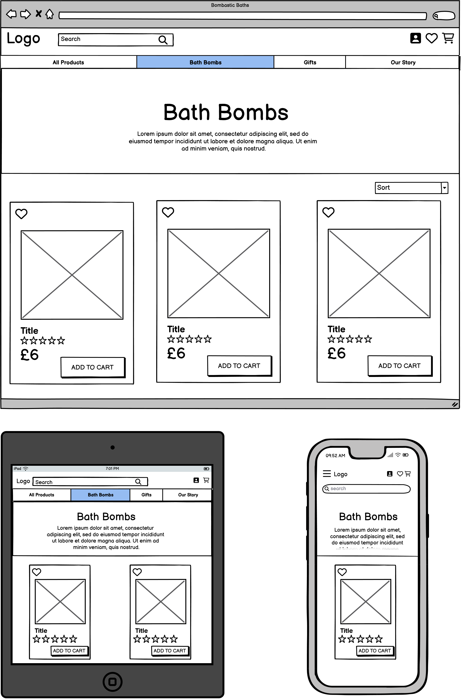
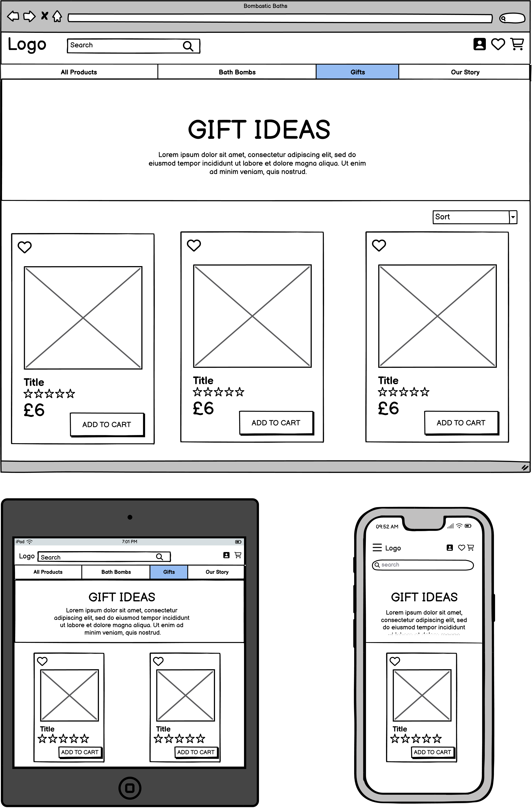
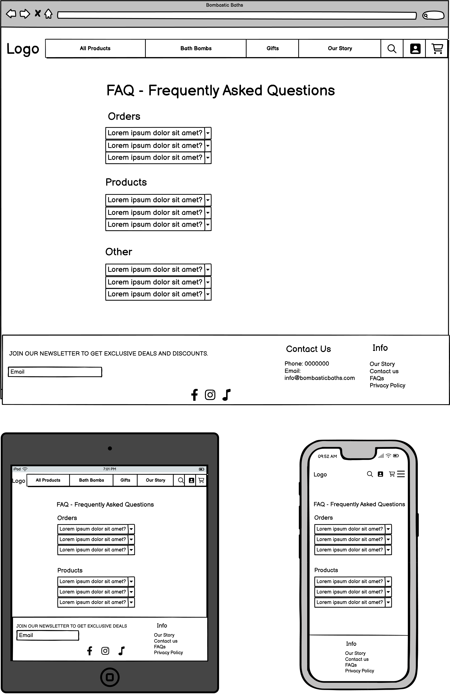
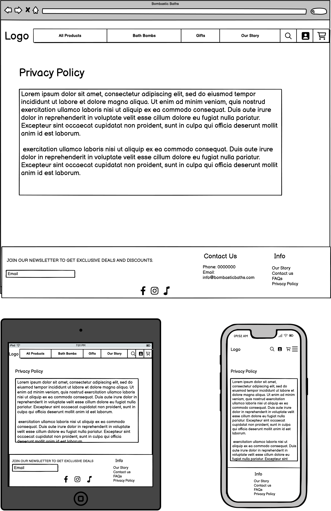
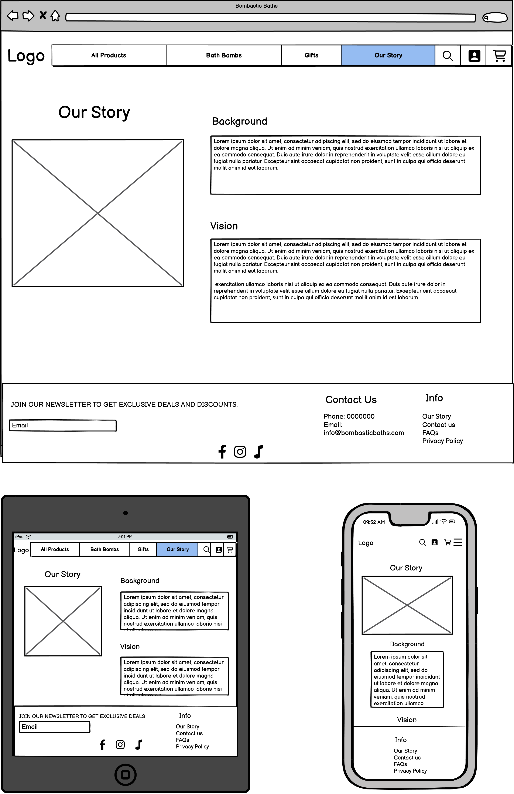

# Bombastic Baths

[View the live webpage here.](placeholder)

## Project Goals
The goals for the project is to create an engaging and user-friendly ecommerce platform for selling bath bombs. To provide customers with a wide range of bath bomb products to choose from. Ensure seamless browsing, shopping, and checkout experiences for users. Implement effective marketing strategies and optimize the website for search engines to attract and retain customers. 

### User Goals
The users goals is to find bath bombs in various scents and designs. Enjoy a smooth and hassle-free shopping experience. Be able to easily navigate the website to discover new products and promotions. Access detailed product information, including ingredients and price. Being able to easily put thing in their wishlist for future purschasing. Receive succesful or unsuccesful confirmation messages when an action has been made. For example when a purschase has been made or a product have been added to the wishlist. Have access to secure and convenient payment options. Benefit from discounts by registrating on the newspaper. 

### Site Owner Goals
The site owner or product owners goals is to drive traffic to the website and increase conversion rates. Offer a diverse range of bath bomb products to cater to different preferences. Maintain an attractive and user-friendly website design.
Implement effective marketing strategies to promote products and engage customers.
Be able to manage the products on the website, add new ones, update them or delete them. Also to have controll over user account for safety reasons. 

# User Experience

### Target Audience
There is diffrent type of customers that would be willing to engage in the website, for example:
1. Skincare Enthusiasts: Individuals who are passionate about skincare products, including bath bombs with diffrent kinds of benefits.

2. Wellness Seekers: People who are focused on self-care and wellness, who appreciate the therapeutic benefits of bath bombs and enjoy a relaxing bath.

3. Gift Shoppers: Individuals looking for unique and luxurious gifts for friends, family, or colleagues, such as gift baskets with bath bombs.

4. Environmentally Conscious Consumers: Eco-friendly individuals who prioritize natural and simple ingridients, vegan friendly options and products against animal testing.

### First Time Users
For all of the first time users, we want the website to be easily discovered and that they get to learn all about Bombastic Baths products. They should have a smooth checkout process, making it easy for them to feel satisfied with their transaction. It schould also be a user-friendly registration for users who want to sign up for an account to access features like wishlists, orders, and exclusive offers.

### Returning visitiors
The goals is to make visitors wanting to return to the website. To achive this we have implemented a newsletter registration where users can get exclusive offers and updates. We also make it easy to access features that get users involved like a wishlist, account settings and order history. A feature implementation will be personalized recommendations based on their past purchases and browsing history so that the user will be getting inspiration and be willing to go back to the store.

# Methodology

### Agile Project Management with GitHub Projects and GitHub Issues
Agile Methodology have been worked at through the project with Githubs project and issues feature. Githubs project board are serving a nice visual representaion for tracking the progress. Githubs issue feature have been used to represent respective user, their acceptance criteria, tasks and labels for prioritising. Each user story has their own label using the MoSCoW priotisation of Must Have, Should Have, Could Have and Won't Have. Every user story is also implemented in diffrent Epics Bugs are also documented as issues to keep track of and resolve.

To view the projects progress, user stories and bugs, see the [Kanban board](https://github.com/users/KlaraMartinsson/projects/5)

### Sprints
Utilizing sprints/iterations have been important to manage our development process effectively. By having sprints in our project, we can break down the work into manageable chunks, maintain a consistent pace of development, and adapt to changes or new requirements quickly.

### [Sprint 1: Initial Setup of Bombastic Baths](https://github.com/KlaraMartinsson/bombastic-baths/milestone/7) 
### [Sprint 2: Product Browsing](https://github.com/KlaraMartinsson/bombastic-baths/milestone/1) 
### [Sprint 3: Checkout](https://github.com/KlaraMartinsson/bombastic-baths/milestone/2) 
### [Sprint 4: User Profiles](https://github.com/KlaraMartinsson/bombastic-baths/milestone/3) 
### [Sprint 5: Extra Features](https://github.com/KlaraMartinsson/bombastic-baths/milestone/4) 
### [Sprint 6: Marketing and SEO](https://github.com/KlaraMartinsson/bombastic-baths/milestone/5) 
### [Sprint 7: Documentation and Testing](https://github.com/KlaraMartinsson/bombastic-baths/milestone/6) 
### [Sprint 8: Potential Features](https://github.com/KlaraMartinsson/bombastic-baths/milestone/8) 

---

### [Epic 1: Viewing and Navigation](https://github.com/KlaraMartinsson/bombastic-baths/issues/1) :mag_right:
This epic focuses on making the website's first impression captivating and easy to navigate. The goals is to create an attractive and user-friendly homepage that helps visitors find their ideal bath bombs. Ultimately ensuring a satisfying overall experience.

- [USER STORY: UX/UI Design Consistency](https://github.com/KlaraMartinsson/bombastic-baths/issues/7)
- [USER STORY: Navigation](https://github.com/KlaraMartinsson/bombastic-baths/issues/8)
- [USER STORY: Responsive Design](https://github.com/KlaraMartinsson/bombastic-baths/issues/9)
- [USER STORY: Browsing Products](https://github.com/KlaraMartinsson/bombastic-baths/issues/15)
- [USER STORY: Product Details Page](https://github.com/KlaraMartinsson/bombastic-baths/issues/18)
- [USER STORY: Categories](https://github.com/KlaraMartinsson/bombastic-baths/issues/19)
- [USER STORY: Our Story Page](https://github.com/KlaraMartinsson/bombastic-baths/issues/20)
- [USER STORY: Privacy Policy Page](https://github.com/KlaraMartinsson/bombastic-baths/issues/21)
- [USER STORY: FAQs Page](https://github.com/KlaraMartinsson/bombastic-baths/issues/22)
- [USER STORY: Error Pages](https://github.com/KlaraMartinsson/bombastic-baths/issues/23)
- [USER STORY: Order Confirmation Page](https://github.com/KlaraMartinsson/bombastic-baths/issues/26)
- [USER STORY: User Accessibility](https://github.com/KlaraMartinsson/bombastic-baths/issues/35)
- [USER STORY: Product Recommendations](https://github.com/KlaraMartinsson/bombastic-baths/issues/41)
- [USER STORY: Gift Kits](https://github.com/KlaraMartinsson/bombastic-baths/issues/43)

### [Epic 2: User Interaction and Engagement](https://github.com/KlaraMartinsson/bombastic-baths/issues/2) :computer:
This epic focusing on the interaction and engagement for users. Such as registrate for an account, handle their personal page and leave reviews.

- [USER STORY: User Registration](https://github.com/KlaraMartinsson/bombastic-baths/issues/12)
- [USER STORY: Easy User Login and Logout](https://github.com/KlaraMartinsson/bombastic-baths/issues/13)
- [USER STORY: Email Confirmation for Registration](https://github.com/KlaraMartinsson/bombastic-baths/issues/14)
- [USER STORY: Users Wishlist](https://github.com/KlaraMartinsson/bombastic-baths/issues/27)
- [USER STORY: Rating and Review Products](https://github.com/KlaraMartinsson/bombastic-baths/issues/29)
- [USER STORY: User Feedback](https://github.com/KlaraMartinsson/bombastic-baths/issues/31)
- [USER STORY: User Profile](https://github.com/KlaraMartinsson/bombastic-baths/issues/32)
- [USER STORY: Delete Profile](https://github.com/KlaraMartinsson/bombastic-baths/issues/33)
- [USER STORY: LiveChat Support](https://github.com/KlaraMartinsson/bombastic-baths/issues/40)

### [Epic 3: Purchasing and Checkout](https://github.com/KlaraMartinsson/bombastic-baths/issues/3) :credit_card:
This epic aims to improve the user's shopping and checkout experience by features like product selection, cart management, secure payment process and finalizing the purchase.

- [USER STORY: Shopping Cart](https://github.com/KlaraMartinsson/bombastic-baths/issues/16)
- [USER STORY: Safe Payment](https://github.com/KlaraMartinsson/bombastic-baths/issues/17)
- [USER STORY: Email Confirmation for Order](https://github.com/KlaraMartinsson/bombastic-baths/issues/30)
- [USER STORY: Product Subscription #42](https://github.com/KlaraMartinsson/bombastic-baths/issues/42)

### [Epic 4: Searching and Sorting](https://github.com/KlaraMartinsson/bombastic-baths/issues/4) :mag_right:
This epic is all about making it easier for users to find and organize stuff on the platform.

- [USER STORY: Search bar](https://github.com/KlaraMartinsson/bombastic-baths/issues/10)
- [USER STORY: Product sorting](https://github.com/KlaraMartinsson/bombastic-baths/issues/11)
- [USER STORY: Categories](https://github.com/KlaraMartinsson/bombastic-baths/issues/19)

### [Epic 5: Site Owner Management](https://github.com/KlaraMartinsson/bombastic-baths/issues/5) :bust_in_silhouette:
This epic introduces comprehensive functionalities, granting site/store owners full control (Create, Read, Update, Delete - CRUD) over product listings.

- [USER STORY: Site Owner functionality](https://github.com/KlaraMartinsson/bombastic-baths/issues/24)
- [USER STORY: Documentation](https://github.com/KlaraMartinsson/bombastic-baths/issues/25)
- [USER STORY: Testing](https://github.com/KlaraMartinsson/bombastic-baths/issues/28)

### [Epic 6: SEO and Web Marketing](https://github.com/KlaraMartinsson/bombastic-baths/issues/37) :globe_with_meridians:
This epic delves into strategies for maximizing website visibility in web searches. Includes utilize Search Engine Optimization (SEO) and diffrent marketing strategies.

- [USER STORY: Newsletter Marketing](https://github.com/KlaraMartinsson/bombastic-baths/issues/34)
- [USER STORY: Optimize Website for Search Engines](https://github.com/KlaraMartinsson/bombastic-baths/issues/36)
- [USER STORY: Social Media Marketing](https://github.com/KlaraMartinsson/bombastic-baths/issues/38)
- [USER STORY: Influencer Marketing](https://github.com/KlaraMartinsson/bombastic-baths/issues/39)

  
### Database Design

#### Database Schema

# Design

### Colors

Color scheme was made at [coolors.co](https://coolors.co/)

### Fonts

### Images

### Wireframes

Wireframes where made at [Balsamiq](https://balsamiq.com/)

Home page

Products page

Product Details page

Bath Bombs page

Gifts page

Profile page

FAQ page

Privacy Policy page

Our Story page

Check Out page

# Features

### Home page

Home page

### Products page

Home page

### Product details page

Product details page

### Profile page

placeholder

### FAQ page

placeholder

### Our Story page

placeholder

### User Account Management

Sign in

Sign up

Sign out

### Confirmation messages

Confirmation message

### Navigation

Navigation bar

Navbar on smaller devices

## Future adaptations

# Issues and Bugs

### Known and unsolved bugs

### Fixed bugs

# Technologies Used

### Languages
  
### Frameworks

### Tools

# Testing

#### Lighthouse result

Desktop

Mobile

### Code Validation

#### HTML

HTML Validation

#### CSS

Whole page

CSS file

#### Python

placeholder

placeholder

## Testing User Stories

Testing of the User stories for the project.
All User Stories can be found [Here](https://github.com/users/KlaraMartinsson/projects/5)

### Manual testing

### Automated testing

# Deployment

# Credits

## Content 

## Media

## Code used

## Acknowledgementes