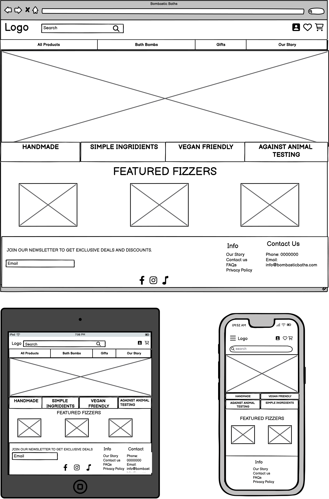
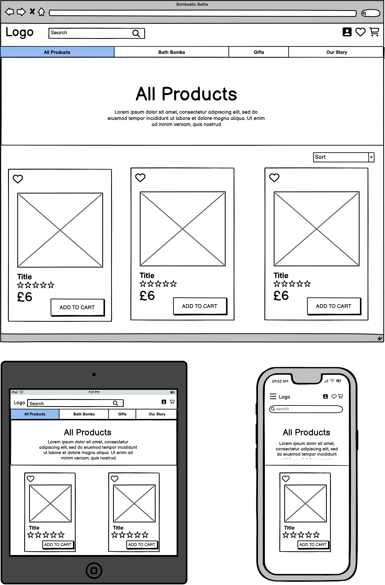
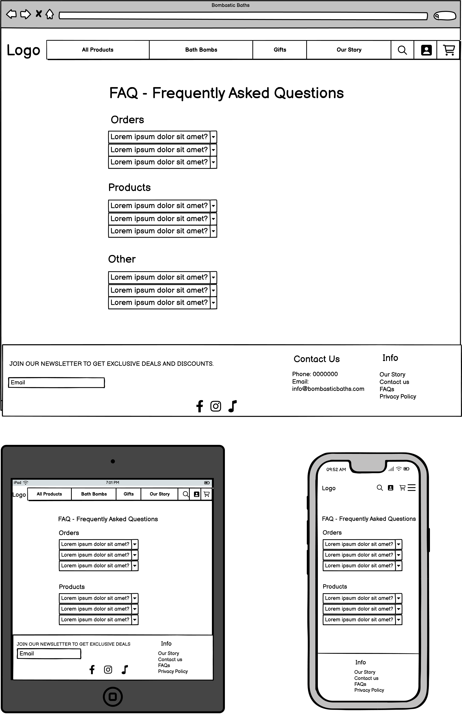
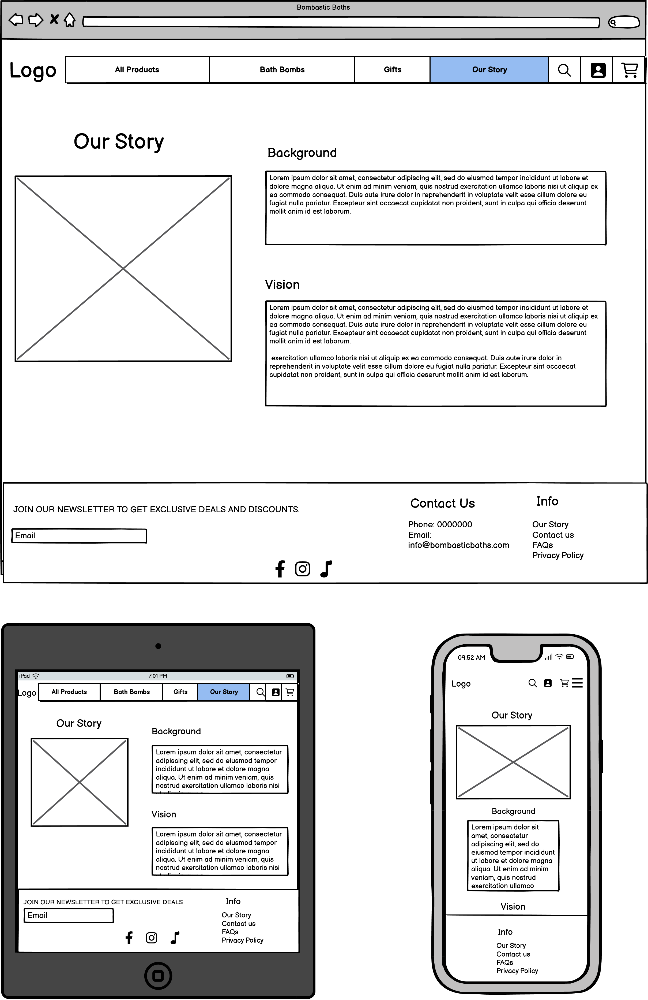

# Bombastic Baths

Welcome to Bombastic Baths! Dive into a world of luxurious bath bombs, meticulously handcrafted for your indulgence. Our products boast simple ingredients, are vegan-friendly, and cruelty-free, ensuring guilt-free pampering. Treat yourself to a relaxing escape and experience the magic of Bombastic Baths today!

[View the live webpage here.](https://bombastic-baths-af5387841714.herokuapp.com/)

### Project Goals
The goals for the project is to create an engaging and user-friendly e-commerce platform for selling bath bombs. To provide customers with a wide range of bath bomb products to choose from. Ensure seamless browsing, shopping, and checkout experiences for users. Implement effective marketing strategies and optimize the website for search engines to attract and retain customers. 

### User Goals
The users goals is to find bath bombs in various scents and designs. Enjoy a smooth and hassle-free shopping experience. Be able to easily navigate the website to discover new products and promotions. Access detailed product information, including ingredients and price. Being able to easily put thing in their wishlist for future purchasing. Receive successful or unsuccessful confirmation messages when an action has been made. For example when a purchase has been made or a product have been added to the wishlist. Have access to secure and convenient payment options. Benefit from discounts by registration for the newspaper. 

### Site Owner Goals
The site owner or product owners goals is to drive traffic to the website and increase conversion rates. Offer a diverse range of bath bomb products to cater to different preferences. Maintain an attractive and user-friendly website design.
Implement effective marketing strategies to promote products and engage customers.
Be able to manage the products on the website, add new ones, update them or delete them. Also to have control over user account for safety reasons. 

# User Experience (UX)

### Target Audience
There is different type of customers that would be willing to engage in the website, for example:
1. Skincare Enthusiasts: Individuals who are passionate about skincare products, including bath bombs with different kinds of benefits.

2. Wellness Seekers: People who are focused on self-care and wellness, who appreciate the therapeutic benefits of bath bombs and enjoy a relaxing bath.

3. Gift Shoppers: Individuals looking for unique and luxurious gifts for friends, family, or colleagues, such as gift baskets with bath bombs.

4. Environmentally Conscious Consumers: Eco-friendly individuals who prioritize natural and simple ingredients, vegan friendly options and products against animal testing.

5. Young individuals who find bath bombs fun and exciting. Who are drawn to vibrant colors, playful shapes, and delightful scents, making bath time an enjoyable experience. They appreciate products that add a touch of magic to their daily routines and seek out bath bombs that promise an element of surprise and delight.

### First Time Users
For all of the first time users, we want the website to be easily discovered and that they get to learn all about Bombastic Baths products. They should have a smooth checkout process, making it easy for them to feel satisfied with their transaction. It should also be a user-friendly registration for users who want to sign up for an account to access features like wishlists, orders, and exclusive offers.

### Returning visitors
The goals is to make visitors wanting to return to the website. To achieve this we have implemented a newsletter registration where users can get exclusive offers and updates. We also make it easy to access features that get users involved like a wishlist, account settings and order history. A feature implementation will be personalized recommendations based on their past purchases and browsing history so that the user will be getting inspiration and be willing to go back to the store.

The site provides a good solution to the first time user’s  and returning visitors demands and expectations.

# Methodology

### Agile Project Management with GitHub Projects and GitHub Issues
Agile Methodology have been worked at through the project with Githubs project and issues feature. Githubs project board are serving a nice visual representation for tracking the progress. Githubs issue feature have been used to represent respective user story, their acceptance criteria, tasks and labels for prioritizing. Each user story has their own label using the MoSCoW prioritizing of Must Have, Should Have, Could Have and Won't Have. Every user story is also implemented in different Epics Bugs, they are also documented as issues to keep track of and resolve.

To view the projects progress, user stories and bugs, see the [Kanban board](https://github.com/users/KlaraMartinsson/projects/5)

### Sprints
Utilizing sprints/iterations have been important to manage our development process effectively. By having sprints in our project, we can break down the work into manageable chunks, maintain a consistent pace of development, and adapt to changes or new requirements quickly.

### [Sprint 1: Initial Setup of Bombastic Baths](https://github.com/KlaraMartinsson/bombastic-baths/milestone/7) 
### [Sprint 2: Product Browsing](https://github.com/KlaraMartinsson/bombastic-baths/milestone/1) 
### [Sprint 3: Checkout](https://github.com/KlaraMartinsson/bombastic-baths/milestone/2) 
### [Sprint 4: User Profiles](https://github.com/KlaraMartinsson/bombastic-baths/milestone/3) 
### [Sprint 5: Extra Features](https://github.com/KlaraMartinsson/bombastic-baths/milestone/4) 
### [Sprint 6: Marketing and SEO](https://github.com/KlaraMartinsson/bombastic-baths/milestone/5) 
### [Sprint 7: Documentation and Testing](https://github.com/KlaraMartinsson/bombastic-baths/milestone/6) 
### [Sprint 8: Potential Features](https://github.com/KlaraMartinsson/bombastic-baths/milestone/8) 

---

### [Epic 1: Viewing and Navigation](https://github.com/KlaraMartinsson/bombastic-baths/issues/1) :eyes:
This epic focuses on making the website's first impression captivating and easy to navigate. The goals is to create an attractive and user-friendly homepage that helps visitors find their ideal bath bombs. Ultimately ensuring a satisfying overall experience.

- [USER STORY: UX/UI Design Consistency](https://github.com/KlaraMartinsson/bombastic-baths/issues/7)
- [USER STORY: Navigation](https://github.com/KlaraMartinsson/bombastic-baths/issues/8)
- [USER STORY: Responsive Design](https://github.com/KlaraMartinsson/bombastic-baths/issues/9)
- [USER STORY: Browsing Products](https://github.com/KlaraMartinsson/bombastic-baths/issues/15)
- [USER STORY: Product Details Page](https://github.com/KlaraMartinsson/bombastic-baths/issues/18)
- [USER STORY: Categories](https://github.com/KlaraMartinsson/bombastic-baths/issues/19)
- [USER STORY: Our Story Page](https://github.com/KlaraMartinsson/bombastic-baths/issues/20)
- [USER STORY: Privacy Policy Page](https://github.com/KlaraMartinsson/bombastic-baths/issues/21)
- [USER STORY: FAQs Page](https://github.com/KlaraMartinsson/bombastic-baths/issues/22)
- [USER STORY: Error Pages](https://github.com/KlaraMartinsson/bombastic-baths/issues/23)
- [USER STORY: Order Confirmation Page](https://github.com/KlaraMartinsson/bombastic-baths/issues/26)
- [USER STORY: User Accessibility](https://github.com/KlaraMartinsson/bombastic-baths/issues/35)
- [USER STORY: Product Recommendations](https://github.com/KlaraMartinsson/bombastic-baths/issues/41)
- [USER STORY: Gift Kits](https://github.com/KlaraMartinsson/bombastic-baths/issues/43)

### [Epic 2: User Interaction and Engagement](https://github.com/KlaraMartinsson/bombastic-baths/issues/2) :computer:
This epic focusing on the interaction and engagement for users. Such as register for an account, handle their personal page and leave reviews.

- [USER STORY: User Registration](https://github.com/KlaraMartinsson/bombastic-baths/issues/12)
- [USER STORY: Easy User Login and Logout](https://github.com/KlaraMartinsson/bombastic-baths/issues/13)
- [USER STORY: Email Confirmation for Registration](https://github.com/KlaraMartinsson/bombastic-baths/issues/14)
- [USER STORY: Users Wishlist](https://github.com/KlaraMartinsson/bombastic-baths/issues/27)
- [USER STORY: Rating and Review Products](https://github.com/KlaraMartinsson/bombastic-baths/issues/29)
- [USER STORY: User Feedback](https://github.com/KlaraMartinsson/bombastic-baths/issues/31)
- [USER STORY: User Profile](https://github.com/KlaraMartinsson/bombastic-baths/issues/32)
- [USER STORY: Delete Profile](https://github.com/KlaraMartinsson/bombastic-baths/issues/33)
- [USER STORY: LiveChat Support](https://github.com/KlaraMartinsson/bombastic-baths/issues/40)

### [Epic 3: Purchasing and Checkout](https://github.com/KlaraMartinsson/bombastic-baths/issues/3) :credit_card:
This epic aims to improve the user's shopping and checkout experience by features like product selection, cart management, secure payment process and finalizing the purchase.

- [USER STORY: Shopping Cart](https://github.com/KlaraMartinsson/bombastic-baths/issues/16)
- [USER STORY: Safe Payment](https://github.com/KlaraMartinsson/bombastic-baths/issues/17)
- [USER STORY: Email Confirmation for Order](https://github.com/KlaraMartinsson/bombastic-baths/issues/30)
- [USER STORY: Product Subscription #42](https://github.com/KlaraMartinsson/bombastic-baths/issues/42)

### [Epic 4: Searching and Sorting](https://github.com/KlaraMartinsson/bombastic-baths/issues/4) :mag_right:
This epic is all about making it easier for users to find and organize stuff on the platform.

- [USER STORY: Search bar](https://github.com/KlaraMartinsson/bombastic-baths/issues/10)
- [USER STORY: Product sorting](https://github.com/KlaraMartinsson/bombastic-baths/issues/11)
- [USER STORY: Categories](https://github.com/KlaraMartinsson/bombastic-baths/issues/19)

### [Epic 5: Site Owner Management](https://github.com/KlaraMartinsson/bombastic-baths/issues/5) :bust_in_silhouette:
This epic introduces comprehensive functionalities, granting site/store owners full control (Create, Read, Update, Delete - CRUD) over product listings.

- [USER STORY: Site Owner functionality](https://github.com/KlaraMartinsson/bombastic-baths/issues/24)
- [USER STORY: Documentation](https://github.com/KlaraMartinsson/bombastic-baths/issues/25)
- [USER STORY: Testing](https://github.com/KlaraMartinsson/bombastic-baths/issues/28)

### [Epic 6: SEO and Web Marketing](https://github.com/KlaraMartinsson/bombastic-baths/issues/37) :globe_with_meridians:
This epic delves into strategies for maximizing website visibility in web searches. Includes utilize Search Engine Optimization (SEO) and different marketing strategies.

- [USER STORY: Newsletter Marketing](https://github.com/KlaraMartinsson/bombastic-baths/issues/34)
- [USER STORY: Optimize Website for Search Engines](https://github.com/KlaraMartinsson/bombastic-baths/issues/36)
- [USER STORY: Social Media Marketing](https://github.com/KlaraMartinsson/bombastic-baths/issues/38)
- [USER STORY: Influencer Marketing](https://github.com/KlaraMartinsson/bombastic-baths/issues/39)

# Business and Marketing Plan

### Business Model 
Bombastic Baths e-commerce operates on a direct-to-consumer(B2C) business model, specializing in handmade natural bath bombs designed to deliver a unique blend of fun and relaxation. Through strategic marketing efforts focused on social media platforms like Instagram, TikTok, and Facebook, Bombastic Baths will targets a diverse user base spanning all age groups. In the future we plan to offer more engaging content showcasing the excitement and benefits of our products, along with enticing sales and discounts delivered through influencers and online platforms. The payment type for this e-commerce is an single payment. Once a customer makes a single payment, the transaction is completed, and a delivery order is promptly generated. The available payment option is payment by card, implemented using Stripe.

### Marketing Plan
When formulating our marketing strategies, we carefully considered the following questions:

Who are Bombastic Baths users?
Bombastic Baths user base spans across all age groups, primarily focusing on girls. From children who find joy in play to teenagers seeking a cool and relaxing experience, and adults craving a moment of tranquility, Bombastic Baths caters to everyone looking for a blissful escape.

Where can you find Bombastic Baths online?
If you're searching for our vibrant community, look no further than Instagram, TikTok, and Facebook.

**Facebook**

What do our users need?
They need bath bombs that are vegan-friendly, cruelty-free (against animal testing), and crafted with simple, wholesome ingredients.
Our users also want engaging content that showcases the excitement and relaxation our bath bombs bring. In the future will we provide videos demonstrating the fun and cool vibes of our products, along with research on their relaxing benefits.

How do we reach out to our users?
Users on Bombastic Baths can sign up to our newsletter where they can find out about all the news and discounts.
In the future, we plan to incorporate strategic sales and irresistible discounts into our marketing approach. Whether through collaborations with influencers, promotions on various platforms, or irresistible friend referral programs.

What marketing practices do other e-commerce businesses that sell similar products employ? Which ones appear to be working best?
The biggest company's that we found and looked into are called LUSH and BOMB Cosmetic. LUSH static where: Youtube: 409K, Instagram:634K, Tiktok: 207K, Facebook: 1,1 mn, X: 408K. BOMB Cosmetic hade: Facebook: 36K, Instagram:  50K. This gave us a better view on what platforms our users will be on. Hence, we've established our presence on Facebook, Instagram, and TikTok.

What are our business goals?
Our business goals encompass several key objectives. Firstly, we aim to establish ourselves as a leading provider of bath bombs that align with values important to our customers. This includes maintaining our commitment to being vegan-friendly, cruelty-free, and using only simple, wholesome ingredients in our products. Additionally, we strive to increase brand awareness, drive traffic to our online platform, and foster customer loyalty.

### Search Engine Optimization (SEO)
By optimizing the e-commerce for search engines, it will increase and reach the right audience, build trust, and stay competitive in the market. 

#### SEO Project planning
After finalizing the business model, the process of identify target keywords begun. We started by brainstorming keywords and then utilized Google to discover popular search terms associated with bath bombs by conducting searches and analyzing the related queries. Additionally, we conducted keyword research on wordtracker.com. This led to the compilation of a list of both short and long-tail keywords. 

#### Keywords
After thorough analysis of Google searches and Wordtracker data, we selected these keywords.

##### Short tailed keywords
- Homemade bath bombs
- Diy bath bombs
- Rainbow bath bomb 
- Bath bomb gift
- Spa at home
- Natural ingredients
- Moisturizing bath bombs
- Relaxation products
- Bath bombs ingredients 
- Bath bomb fizzers

##### Long tailed keywords
- Get yourself a well deserved bath
- How do I use a bath bomb
- Fragrance free bath bombs 
- Bath bombs with rings
- Vegan friendly bath bombs

#### Implementation:

Content Integration:

Infuse long tailed keywords into product descriptions, titles, and various content segments. Maintain a seamless narrative while accentuating the distinctive attributes of each product.

Meta Tags and Descriptions:

Embed extensive keywords into meta tags, meta descriptions, and image alt text. This enriches search engine optimization (SEO) efforts and enhances visibility for pertinent search queries.

Header Tags:

Employ header tags to organize content effectively, making it easier for search engine crawlers to understand the structure and context of the page.

Strong Tags (Strong Emphasis):

Utilize the HTML strong tag to underscore crucial keywords or phrases. This aids search engines in recognizing the significance of these terms within the content.

Link Descriptions:

Ensure all internal and external links are appropriately labeled. 

Alt Text for Images:

When incorporating images, provide descriptive alt text featuring keywords to enhance accessibility and SEO effectiveness.

##### Sitemap.xml
A sitemap was generated using xml-sitemaps This was generated using the deployed website. The file is included in the root level of the project.

##### Robots.txt
Robots.txt file was created at the root level of the project. This file tells the search engine crawlers which URLs they can access on the website.
  
# Database
When creating the database structure schema for this project, I utilized the [dbdiagram.io](https://dbdiagram.io/) website. This online tool allowed me to visually design and document the database schema, making it easier to plan and implement the database. This database schema defines the structure and relationships for an e-commerce, including users, products, reviews, user profiles, cart, payment checkout and more.

# Design (UI)

### Building a User-Friendly E-commerce Platform

While designing the e-commerce platform, a core focus was placed on creating a user-friendly experience through clear organization and information. All resources on the site are easy to find because everything is well-organized and presented clearly. User will be able to navigate the layout of the site intuitively, moving seamlessly from browsing categories to product pages and checkout. We also focused of prioritization of information. With semantic markup, I could highlight the crucial details for each product. Information is presented and categorized in terms of its priority. This means product descriptions and prices are front and center, while additional details like reviews are easily accessible but don't clutter the main view.

### User Control

The user should always get a positive emotional response when interacting with the website. To make this happen the website has a clear layout, easy and unambiguous navigation structures and all interaction feedback, using colours and confirmation messages. Other things that we keept in mind are:

- The user is shown progress indicators and feedback on transactions.

- Errors resulting from user or data actions are reported to the user.

### Consistency
One of the most important things we put time on was to have a consistency of design through all of the websites pages/sections. We been doing this by colours, fonts and layout.

### Accessibility
- High-Contrast Design: We employed color combinations with sufficient contrast between text and background for better readability.
- We designed a clean and consistent layout with predictable placement of elements, making the website intuitive to navigate

### Main Colours

Color scheme was made at [coolors.co](https://coolors.co/)

We thought about what kind of mood we wanted to create for the website. Purple and pink together is a good balance. Purple can lean luxurious and sophisticated, while pink adds a touch of playfulness and energy.

We used black and white to create good contrast , they also help make the purple and pink pop even more."

### Fonts
The Bombastic Baths website are using the default fonts due to its cleanness and readability.

### Images
The images that are displaying on Bombastic Baths where generated on [leonardo.io](https://leonardo.ai/). I used an image that the ai generator could have as guidance, which gave me consistent product images. The hero images in the header on the home page are taken from [freepik.com](https://www.freepik.com/)

### Favicon
The favicon where made at [favicon.io](https://favicon.io/) with Bombastic Baths pink colour.

### Wireframes

Wireframes where made at [Balsamiq](https://balsamiq.com/)

## Thoughts on wirefrasmes, why I used them etc. demonstrate that these have been followed through to implementation.

Home page

Products page

Product Details page

Profile page

FAQ page

Privacy Policy page

Our Story page

Check Out page

# Features

### Home page

Home page

### Products page

Home page

### Product details page

Product details page

### Profile page

placeholder

### FAQ page

placeholder

### Our Story page

placeholder

### User Account Management

Sign in

Sign up

Sign out

### Confirmation messages

Confirmation message

### Navigation

Navigation bar

Navbar on smaller devices

### Future Implementations

Some future adaptations the website could have are:

- Personalized recommendations based on customers' past purchases and browsing history. This would inspire users, increasing their engagement with the store and encouraging them to return for more.

- Another future enhancement for the website would involve collaborating with influencers to amplify our marketing efforts.

- Create an option for customers to subscribe for monthly bath bombs.

- Have a LiveChat so that users can quickly resolve any queries or issues.

# Issues and Bugs

### Known and unsolved bugs

### Fixed bugs

# Technologies Used

### Languages
- Python
- HTML5
- CSS3
- Django Template Language
- Markdown
  
### Frameworks

- Django: A web framework that uses high-level Python. To enable full stack development for this project.
- Bootstrap v5.0: Bootstrap is a framework to use for its easy responsiveness management tools and a lot more. I used it to make the website more available on all different screens and to reduce code work.
- ElephantSQL: ElephantSQL is a PostgreSQL database. It is used as a cloud based database storage for the application's data.

### Tools

- GitHub: I used GitHud for repositories storage and Agile project management using Kanban boards/issue tracking.
- VsCode: Used to store and write code.
- Heroku: Heroku is a cloud platform that I used for deployment to make this project into a live server.

# Testing
The Bombastic Baths e-commerce website underwent a thorough testing procedure to ensure it works well for everyone and performs smoothly. This involved examining the code, such as code validation, accessibility assessment, performance testing, cross-device testing, verification of browser compatibility, assessment of user stories, and the integration of user feedback to enhance the overall user experience. 

All testing, including both manual and automated testing, was carried out and documented in [TESTING.md.](/TESTING.md)

# Deployment

# Credits

### Content 

### Media

### Code used

### Acknowledgements